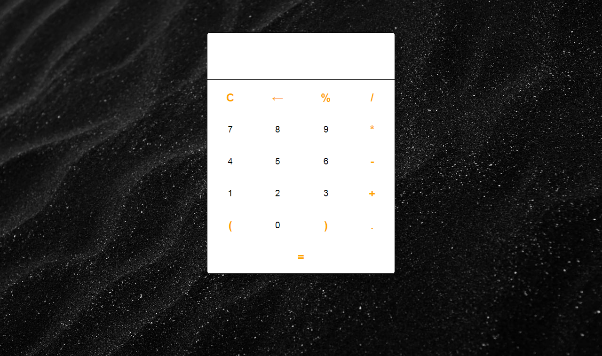

### Calculator Js
___

#### Link to the live website:
[Calculator](https://fatscythe.github.io/Calculator-JS/ "Calculator live site")
___

#### Description : Calculator Js is a dynamic calculator built with Javascript, it uses query selector, array, event listeners, switch conditional statement and try and catch block to function as a simple calculator
____

#### Tech Used : Html, CSS, JS, git, github.
___

#### Design image :

#### Credits: Scythe and some guy on youtube 